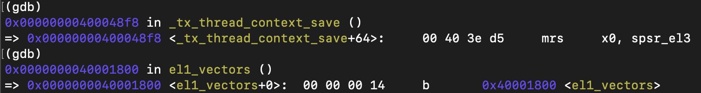

## what are xen & threadx?
[xen](https://xenproject.org) is a type-I hypervisor, [threadx](https://threadx.io) is a RTOS.

## why we need virtualization?
in many industries, it is necessary to be able to run different operating systems (or even no operating system at all) to meet various business requirements. multiple OS could be run without hypervisor. however, the system mostly restart if one core crashed. the embedded field has extremely high requirements for stability, and virtualization can enhance stability.

others include, resource efficiency, isolation and security, scalability and flexibility, and so on.

## why xen & threadx?
QNX is primarily used in the automotive sector and is a closed-source operating system.

## prerequisites
in the development environment, I used QEMU to emulate one board, and the board's SoC adopts an ARM multi-core processor. using QEMU is flexible, low-cost, convenient for debugging (the most important aspect), and easy to promote (users don't need to purchase a development board).

all the reference implementation: <https://github.com/tw-embedded/baize-board>

## whole architecture


Exception Levels (EL): hierarchical privilege levels in ARM architecture. it determines the amount of control and access a process or code running at a particular level has. there are four levels, from EL0 to EL3, each with different levels of privilege:

EL0: the lowest privilege level, typically used for user applications.

EL1: used for operating system kernels and drivers.

EL2: used for hypervisors in virtualization scenarios.

EL3: the highest privilege level, usually for secure monitor code and system management.

## all key steps

### step 1. build threadx project

after cloning the project repository, create a new build folder for porting to xen:

```bash
cp -r ./ports/cortex_a53/gnu/example_build/sample_threadx ./ports/cortex_a53/gnu/xen_build
```

yes, here i selected cortex a53 as target. added several cmake files:

```diff
cmake/aarch64-linux-gnu.cmake
+set(CMAKE_C_COMPILER    aarch64-linux-gnu-gcc)
+set(CMAKE_CXX_COMPILER  aarch64-linux-gnu-g++)
+set(AS                  aarch64-linux-gnu-as)
+set(AR                  aarch64-linux-gnu-ar)
+set(OBJCOPY             aarch64-linux-gnu-objcopy)
+set(OBJDUMP             aarch64-linux-gnu-objdump)
+set(SIZE                aarch64-linux-gnu-size)
+
+set(CMAKE_FIND_ROOT_PATH_MODE_PROGRAM NEVER)
+set(CMAKE_FIND_ROOT_PATH_MODE_LIBRARY ONLY)
+set(CMAKE_FIND_ROOT_PATH_MODE_INCLUDE ONLY)
+set(CMAKE_FIND_ROOT_PATH_MODE_PACKAGE ONLY)
+
+# this makes the test compiles use static library option so that we don't need to pre-set linker flags and scripts
+set(CMAKE_TRY_COMPILE_TARGET_TYPE STATIC_LIBRARY)
+
+set(CMAKE_C_FLAGS   "${MCPU_FLAGS} ${VFP_FLAGS} ${SPEC_FLAGS} -fdata-sections -ffunction-sections" CACHE INTERNAL "c compiler flags")
+set(CMAKE_CXX_FLAGS "${MCPU_FLAGS} ${VFP_FLAGS} -fdata-sections -ffunction-sections -fno-rtti -fno-exceptions -mlong-calls" CACHE INTERNAL "cxx compiler flags")
+set(CMAKE_ASM_FLAGS "${MCPU_FLAGS} ${VFP_FLAGS} -x assembler-with-cpp" CACHE INTERNAL "asm compiler flags")
+set(CMAKE_EXE_LINKER_FLAGS "${MCPU_FLAGS} ${LD_FLAGS} -Wl,--gc-sections" CACHE INTERNAL "exe link flags")
+
+SET(CMAKE_C_FLAGS_DEBUG "-Og -g -ggdb3" CACHE INTERNAL "c debug compiler flags")
+SET(CMAKE_CXX_FLAGS_DEBUG "-Og -g -ggdb3" CACHE INTERNAL "cxx debug compiler flags")
+SET(CMAKE_ASM_FLAGS_DEBUG "-g -ggdb3" CACHE INTERNAL "asm debug compiler flags")
+
+SET(CMAKE_C_FLAGS_RELEASE "-O3" CACHE INTERNAL "c release compiler flags")
+SET(CMAKE_CXX_FLAGS_RELEASE "-O3" CACHE INTERNAL "cxx release compiler flags")
+SET(CMAKE_ASM_FLAGS_RELEASE "" CACHE INTERNAL "asm release compiler flags")

cmake/cortex_a53.cmake
+set(CMAKE_SYSTEM_NAME Generic)
+set(CMAKE_SYSTEM_PROCESSOR cortex-a53)
+
+set(THREADX_ARCH "cortex_a53")
+set(THREADX_TOOLCHAIN "gnu")
+
+set(MCPU_FLAGS "-mcpu=cortex-a53")
+set(VFP_FLAGS "")
+
+include(${CMAKE_CURRENT_LIST_DIR}/aarch64-linux-gnu.cmake)

ports/cortex_a53/gnu/CMakeLists.txt
+target_sources(${PROJECT_NAME} PRIVATE
+    ${CMAKE_CURRENT_LIST_DIR}/src/tx_initialize_low_level.S
+    ${CMAKE_CURRENT_LIST_DIR}/src/tx_thread_context_restore.S
+    ${CMAKE_CURRENT_LIST_DIR}/src/tx_thread_context_save.S
+    ${CMAKE_CURRENT_LIST_DIR}/src/tx_thread_fp_disable.c
+    ${CMAKE_CURRENT_LIST_DIR}/src/tx_thread_fp_enable.c
+    ${CMAKE_CURRENT_LIST_DIR}/src/tx_thread_interrupt_control.S
+    ${CMAKE_CURRENT_LIST_DIR}/src/tx_thread_interrupt_disable.S
+    ${CMAKE_CURRENT_LIST_DIR}/src/tx_thread_interrupt_restore.S
+    ${CMAKE_CURRENT_LIST_DIR}/src/tx_thread_schedule.S
+    ${CMAKE_CURRENT_LIST_DIR}/src/tx_thread_stack_build.S
+    ${CMAKE_CURRENT_LIST_DIR}/src/tx_thread_system_return.S
+    ${CMAKE_CURRENT_LIST_DIR}/src/tx_timer_interrupt.S
+)
+
+target_include_directories(${PROJECT_NAME} PUBLIC
+    ${CMAKE_CURRENT_LIST_DIR}/inc
+)
+
+set(APP_NAME threadxen)
+set(EXE_NAME ${APP_NAME}.elf)
+set(LDS ${CMAKE_CURRENT_LIST_DIR}/xen_build/threadx.ld)
+add_executable(${EXE_NAME})
+target_link_libraries(${EXE_NAME} ${PROJECT_NAME})
+target_link_options(${EXE_NAME} PRIVATE -T ${LDS})
+target_sources(${EXE_NAME} PRIVATE
+    # {{BEGIN_TARGET_SOURCES}}
+       ${CMAKE_CURRENT_LIST_DIR}/xen_build/main.c
+       ${CMAKE_CURRENT_LIST_DIR}/xen_build/gicv3_gicd.c
+       ${CMAKE_CURRENT_LIST_DIR}/xen_build/gicv3_gicr.c
+       ${CMAKE_CURRENT_LIST_DIR}/xen_build/sp804_timer.c
+       ${CMAKE_CURRENT_LIST_DIR}/xen_build/timer_interrupts.c
+       ${CMAKE_CURRENT_LIST_DIR}/xen_build/mp_mutexes.s
+       ${CMAKE_CURRENT_LIST_DIR}/xen_build/startup.s
+       ${CMAKE_CURRENT_LIST_DIR}/xen_build/v8_aarch64.s
+       ${CMAKE_CURRENT_LIST_DIR}/xen_build/v8_utils.s
+       ${CMAKE_CURRENT_LIST_DIR}/xen_build/vectors.s
+       ${CMAKE_CURRENT_LIST_DIR}/xen_build/pecoff.s
+    # {{END_TARGET_SOURCES}}
+)
+add_custom_command(
+    TARGET ${EXE_NAME}
+    POST_BUILD
+    COMMAND ${CMAKE_OBJCOPY} ${EXE_NAME} -O binary ${APP_NAME}
+)
```

execute the following commands to build threadx:

```bash
cmake -Bbuild -GNinja -DCMAKE_TOOLCHAIN_FILE=cmake/cortex_a53.cmake
cmake --build ./build
```

the binary file is in the folder:

```bash
➜  threadx git:(c349997) ls build/ports/cortex_a53/gnu
CMakeFiles  cmake_install.cmake  threadxen  threadxen.elf
➜  threadx git:(c349997) file build/ports/cortex_a53/gnu/threadxen.elf
build/ports/cortex_a53/gnu/threadxen.elf: ELF 64-bit LSB executable, ARM aarch64, version 1 (SYSV), dynamically linked, interpreter /lib/ld-linux-aarch64.so.1, for GNU/Linux 3.7.0, BuildID[sha1]=40e3d7911d897c77c80c2058d9aadf4d99843761, not stripped
```

### step 2. update device tree of xen

```text
		cp_threadx: cpupool1 {
			compatible = "xen,cpupool";
			cpupool-cpus = <&cpu7>;
			cpupool-sched = "null";
		};
		...
		domus {
			compatible = "xen,domain";
			#address-cells = <2>;
			#size-cells = <2>;
			cpus = <1>;
			memory = <0 0x10000>;
			vpl011;
			domain-cpupool = <&cp_threadx>;

			module@1 {
				compatible = "multiboot,kernel", "multiboot,module";
				xen,uefi-binary = "threadxen";
				bootargs = "console=ttyAMA0";
			};
		};
```

here, i have allocated one CPU for threadx, which means that threadx does not need to support SMP for the time being.
the memory available to threadx is very limited, with only 0x10000 bytes.
additionally, threadx is being booted in a typical dom0-less configuration.

### step 3. boot threadx

as expected, the boot failed.


review the most recent non-failing logs and trace them back to the corresponding code。

```text
(XEN) *** LOADING DOMU cpus=1 memory=10000KB ***
(XEN) Loading d1 kernel from boot module @ 0000000127aaa000
```

it is in the `kernel_probe` function of xen.


the threadx image is neither a uImage nor 32-bit, so we should next examine the `kernel_zimage64_probe` function.

```c
static int __init kernel_zimage64_probe(struct kernel_info *info,
                                        paddr_t addr, paddr_t size)
{
    /* linux/Documentation/arm64/booting.txt */
    struct {
        uint32_t magic0;
        uint32_t res0;
        uint64_t text_offset;  /* Image load offset */
        uint64_t res1;
        uint64_t res2;
        /* zImage V1 only from here */
        uint64_t res3;
        uint64_t res4;
        uint64_t res5;
        uint32_t magic1;
        uint32_t res6;
    } zimage;
    uint64_t start, end;

    if ( size < sizeof(zimage) )
        return -EINVAL;

    copy_from_paddr(&zimage, addr, sizeof(zimage));

    if ( zimage.magic0 != ZIMAGE64_MAGIC_V0 &&
         zimage.magic1 != ZIMAGE64_MAGIC_V1 )
        return -EINVAL;
```

`kernel_zimage64_probe` checks the magic number, the macros are defined:

```c
#define ZIMAGE64_MAGIC_V0 0x14000008
#define ZIMAGE64_MAGIC_V1 0x644d5241 /* "ARM\x64" */
```

open the documentation in the comment of the kernel_zimage64_probe function:


check the header of linux kernel image layout:


check the file format of linux kernel image:

```bash
➜  linux git:(6a77b390) file ./build/arch/arm64/boot/Image
Image: MS-DOS executable PE32+ executable (EFI application) Aarch64 (stripped to external PDB), for MS Windows
```

clearly, the linux image header contains a pe-format header. the threadx image needs it also.

### step 4. add pecoff (Portable Executable and Common Object File Format) header

pecoff (Portable Executable/Common Object File Format) is the file format used by Microsoft Windows for executable files, dynamic link libraries, and object files, extending the common object file format (COFF) with additional features specific to Windows.

first, add a new file [threadx/ports/cortex_a53/gnu/xen_build/pecoff.s](https://github.com/tw-embedded/threadx/blob/master/ports/cortex_a53/gnu/xen_build/pecoff.s) and include it in the build process.

second, add pecoff section to the start of the image.

```diff
threadx/ports/cortex_a53/gnu/xen_build/threadx.ld
ENTRY(_threadxen_start)
SECTIONS
{
    . = 0x10000000; /* THREADXEN_VA */
    _threadxen_start = .;
+    .pecoff : {
+        KEEP(*(.pecoff))
+    }
```

### step 5. boot threadx

no obvious error logs.


the kernel_probe function has finished executing (confirm this through step-by-step debugging).

next, verify the subsequent execution flow: kernel_probe() -> construct_domU() -> create_domUs() -> start_xen()

arrive at the key function start_xen:

```c
/* C entry point for boot CPU */
void __init start_xen(unsigned long boot_phys_offset,
                      unsigned long fdt_paddr)
{
    ...

    if ( acpi_disabled )
    {
        create_domUs();
        alloc_static_evtchn();
    }

    /*
     * This needs to be called **before** heap_init_late() so modules
     * will be scrubbed (unless suppressed).
     */
    discard_initial_modules();

    heap_init_late();

    init_trace_bufs();

    init_constructors();

    console_endboot();

    /* Hide UART from DOM0 if we're using it */
    serial_endboot();

    if ( (rc = xsm_set_system_active()) != 0 )
        panic("xsm: unable to switch to SYSTEM_ACTIVE privilege: %d\n", rc);

    system_state = SYS_STATE_active;

    for_each_domain( d )
        domain_unpause_by_systemcontroller(d);

    /* Switch on to the dynamically allocated stack for the idle vcpu
     * since the static one we're running on is about to be freed. */
    memcpy(idle_vcpu[0]->arch.cpu_info, get_cpu_info(),
           sizeof(struct cpu_info));
    switch_stack_and_jump(idle_vcpu[0]->arch.cpu_info, init_done);
}
```

final stack switch and jump, and single-step debugging confirms execution reaches this point.


the boot address of the virtual machine can be found in the logs:


set a breakpoint:


GDB stopped at the breakpoint:


clearly, this instruction is the first instruction of the pecoff header we added.


debugging, the threadx vm crashed because it attempts to access the EL3 register (the default threadx example code is started from bare-metal), while threadx is running in EL1 in the current system.

modify the jump address to el1_entry_aarch64 in the pecoff header:


step-by-step debugging, it trapped in hypervisor:


here, 0x80054e30 is program address. obviously, the address accessed by function EnableGICD exceeds the range allocated by xen.

hence, it causes a trap into the hypervisor xen.

### step 6. update memory layout of threadx

threadx calls the function EnableGICD directly in sample startup.s before initializing the MMU, so the implicit information is that the virtual addresses and physical addresses are the same in the memory layout.

it is not perfect, but just follow it now.

from boot log, the physical address of threadx vm is 0x40000000.

```diff
ports/cortex_a53/gnu/xen_build/threadx.ld
+   . = 0x40000000; /* THREADXEN_VA */
-   . = 0x80000000; /* THREADXEN_VA */
    _threadxen_start = .;
    .pecoff : {
        KEEP(*(.pecoff))
    }
```

rebuild threadx and restart debugging.

EnableGICD still caused a trap:


check the source of EnableGICD:

```c
GICv3_distributor __attribute__((section(".gicd"))) gicd;

void EnableGICD(GICDCTLRFlags_t flags)
{
    gicd.GICD_CTLR |= flags;
}
```

check the .gicd section in lds:

```text
ports/cortex_a53/gnu/xen_build/threadx.ld
    /*
     * GICv3 distributor
     */
    .gicd 0x2f000000 (NOLOAD):
    {
        *(.gicd)
    }
```

so 0x2f000000 is the physical address of gicd, of course, it need to be updated.

### step 7. update gic address space

as we known, xen has interrupt virtualization capabilities.

the GIC (Generic Interrupt Controller) operated within virtual machine (VM) is virtualized by xen, meaning the vm does not directly access the hardware GIC.

interrupt requests are first received by xen, which then forwards these interrupts to the corresponding vm for handling.

this allows xen to manage and allocate interrupts effectively, enabling efficient sharing and isolation of hardware resources in a multi-vm environment.

the address space of gic is allocated by xen.

check the gicd base from xen source:

create_domUs(void)/construct_domU()/prepare_dtb_domU()/make_gic_domU_node()

```c
static int __init make_gic_domU_node(struct kernel_info *kinfo)
{
    switch ( kinfo->d->arch.vgic.version )
    {
#ifdef CONFIG_GICV3
    case GIC_V3:
        return make_gicv3_domU_node(kinfo);
#endif
    case GIC_V2:
        return make_gicv2_domU_node(kinfo);
    default:
        panic("Unsupported GIC version\n");
    }
}
```

here, the SoC uses gic v3.

```c
static int __init make_gicv3_domU_node(struct kernel_info *kinfo)
{
    void *fdt = kinfo->fdt;
    int res = 0;
    __be32 *reg, *cells;
    const struct domain *d = kinfo->d;
    /* Placeholder for interrupt-controller@ + a 64-bit number + \0 */
    char buf[38];
    unsigned int i, len = 0;

    snprintf(buf, sizeof(buf), "interrupt-controller@%"PRIx64,
             vgic_dist_base(&d->arch.vgic));

    res = fdt_begin_node(fdt, buf);
    if ( res )
        return res;

    res = fdt_property_cell(fdt, "#address-cells", 0);
    if ( res )
        return res;

    res = fdt_property_cell(fdt, "#interrupt-cells", 3);
    if ( res )
        return res;

    res = fdt_property(fdt, "interrupt-controller", NULL, 0);
    if ( res )
        return res;

    res = fdt_property_string(fdt, "compatible", "arm,gic-v3");
    if ( res )
        return res;

    /* reg specifies all re-distributors and Distributor. */
    len = (GUEST_ROOT_ADDRESS_CELLS + GUEST_ROOT_SIZE_CELLS) *
          (d->arch.vgic.nr_regions + 1) * sizeof(__be32);
    reg = xmalloc_bytes(len);
    if ( reg == NULL )
        return -ENOMEM;
    cells = reg;

    dt_child_set_range(&cells, GUEST_ROOT_ADDRESS_CELLS, GUEST_ROOT_SIZE_CELLS,
                       vgic_dist_base(&d->arch.vgic), GUEST_GICV3_GICD_SIZE);

    for ( i = 0; i < d->arch.vgic.nr_regions; i++ )
        dt_child_set_range(&cells,
                           GUEST_ROOT_ADDRESS_CELLS, GUEST_ROOT_SIZE_CELLS,
                           d->arch.vgic.rdist_regions[i].base,
                           d->arch.vgic.rdist_regions[i].size);

    res = fdt_property(fdt, "reg", reg, len);
    xfree(reg);
    if (res)
        return res;

    res = fdt_property_cell(fdt, "linux,phandle", kinfo->phandle_gic);
    if (res)
        return res;

    res = fdt_property_cell(fdt, "phandle", kinfo->phandle_gic);
    if (res)
        return res;

    res = fdt_end_node(fdt);

    return res;
}
```

**xen passes hardware information to the vm through the device tree.**

here, i temporarily hardcoded the gic address into the threadx source code but support device trees.

to confirm the addresses of the gic-v3 related registers, continue reading the source code, use GDB for debugging, or add print statements.

ultimately, the gic address information obtained is as follows:

```text
gicd base 0x3001000

gicr base 0x3020000, size 0x1000000
```

then hardcode these addresses:

```diff
threadx/ports/cortex_a53/gnu/xen_build/threadx.ld
    /*
     * GICv3 distributor
     */
-   .gicd 0x2f000000 (NOLOAD):
+   .gicd 0x3001000 (NOLOAD):
    {
        *(.gicd)
    }

    /*
     * GICv3 redistributors
     * 128KB for each redistributor in the system
     */
-   .gicr 0x2f100000 (NOLOAD):
+   .gicr 0x3020000 (NOLOAD):
    {
        *(.gicr)
    }
```

after updated the gic address, the function EnableGICD can complete execution.

TODO: how does xen implement interrupt virtualization?

### step 8. go to main

upon continuing execution, a crash is still encountered before main.

the instruction that caused the crash is a call to memset.


of course PLT (Procedure Linkage Table) could not be used here.

i added one simple libc ([rtos/libc](https://github.com/tw-embedded/baize-board/tree/master/rtos/libc)) for threadx to solve this issue.

disable the standard libraries and startup files.

```diff
cmake/aarch64-linux-gnu.cmake
-set(CMAKE_C_FLAGS   "${MCPU_FLAGS} ${VFP_FLAGS} ${SPEC_FLAGS} -fdata-sections -ffunction-sections" CACHE INTERNAL "c compiler flags")
+set(CMAKE_C_FLAGS   "${MCPU_FLAGS} ${VFP_FLAGS} ${SPEC_FLAGS} -nostdlib -fdata-sections -ffunction-sections" CACHE INTERNAL "c compiler flags")

cmake/cortex_a53.cmake
+set(LD_FLAGS "-nostartfiles")

ports/cortex_a53/gnu/CMakeLists.txt
+target_link_libraries(${APP_NAME} ${CMAKE_SOURCE_DIR}/../libc/build/libc.a)
```

finally, it comes the main function.

### step 9. printf

now we have entered the world of c language!

being able to use printf is a good idea!

linux must support early print on xen, so check linux source code:

```c
linux/drivers/tty/hvc/hvc_xen.c
static int dom0_write_console(uint32_t vtermno, const char *str, int len)
{
	int rc = HYPERVISOR_console_io(CONSOLEIO_write, len, (char *)str);
	if (rc < 0)
		return rc;

	return len;
}
static void xenboot_earlycon_write(struct console *console,
				  const char *string,
				  unsigned len)
{
	dom0_write_console(0, string, len);
}

static int __init xenboot_earlycon_setup(struct earlycon_device *device,
					    const char *opt)
{
	device->con->write = xenboot_earlycon_write;
	return 0;
}
EARLYCON_DECLARE(xenboot, xenboot_earlycon_setup);
```

HYPERVISOR_console_io is defined here:

```c
linux/arch/arm64/xen/hypercall.s

#define XEN_IMM 0xEA1

#define HYPERCALL_SIMPLE(hypercall)		\
ENTRY(HYPERVISOR_##hypercall)			\
	mov x16, #__HYPERVISOR_##hypercall;	\
	hvc XEN_IMM;				\
	ret;					\
ENDPROC(HYPERVISOR_##hypercall)

#define HYPERCALL3 HYPERCALL_SIMPLE

HYPERCALL3(console_io);
```

obviously, the vm obtains xen's print services through a hypercall instruction.

next, port this functionality to threadx.

[ports/cortex_a53/gnu/xen_build/hypercall.s](https://github.com/tw-embedded/threadx/blob/master/ports/cortex_a53/gnu/xen_build/hypercall.s)

[ports/cortex_a53/gnu/xen_build/xen.h](https://github.com/tw-embedded/threadx/blob/master/ports/cortex_a53/gnu/xen_build/xen.h)

try to print something:


yes, it is!


i want to use printf but HYPERVISOR_console_io.

```diff
ports/cortex_a53/gnu/CMakeLists.txt
+${CMAKE_CURRENT_LIST_DIR}/xen_build/putc.c

ports/cortex_a53/gnu/xen_build/putc.c
+#include <stdint.h>
+#include <stddef.h>
+
+#define CONSOLEIO_write 0
+void HYPERVISOR_console_io(int no, size_t size, uint8_t *str);
+
+int console_putc(unsigned char c)
+{
+	HYPERVISOR_console_io(CONSOLEIO_write, 1, &c);
+	return 1;
+}
```

now, printf works.

### step 10. timer

the main function is responsible for two tasks: initializing hardware (gic, timer) and starting threadx.

```c
int main(void)
{
    printf("threadx\n");

    /* Initialize timer. */
    init_timer();

    /* Enter ThreadX. */
    tx_kernel_enter();

    return 0;
}
```

since the gic has already been configured with the address space, now focus on the timer.

timer is a core component of the os.

by providing periodic interrupts, the os schedules tasks efficiently to achieve effective multitasking and system operation.

to enable the timer, the main considerations are the timer mechanism, gic interrupt handling, the timer interrupt configuration, and the timer configuration.

#### 10.1 timer mechanism

according to 'AArch64 Programmer's Guides - Generic Timer', arm-v8 includes the generic timer.

the generic timer provides a standardized timer framework for arm cores.


the number of timers that a core provides (depends on which extensions are implemented):

https://developer.arm.com/documentation/102142/0100/Virtualizing-the-generic-timers


the virtual count allows a hypervisor to show virtual time to a virtual machine (VM). for example, a hypervisor could hide the passage of time when the VM was not scheduled. this means that the virtual count can represent time experienced by the VM, rather than wall clock time.

so choose virtual timer as os tick.

the interrupt ID (INTID) that is used for each timer is defined by the Server Base System Architecture (SBSA), shown here:


TODO: add xen timer virtualization and debug the intid allocated by xen.

#### 10.2 gic interrupt handling

GICv3 (Generic Interrupt Controller version 3) is an ARM architecture interrupt controller that efficiently manages interrupts in multi-core processors, supports a larger number of interrupt sources, and introduces system-level and virtualization-related interrupt management features.

according to 'Arm Generic Interrupt Controller v3 and v4 Overview', the register interface of a GICv3 interrupt controller is split into three groups:

- distributor interface

- redistributor interface

- CPU interface


each interrupt source is identified by an ID number, which is referred to as an INTID. the interrupt types that are introduced in the preceding list are defined in terms of ranges of INTIDs:


In terms of scope, the timer interrupt belongs to PPI (Private Peripheral Interrupt).

note: timers can be configured to generate an interrupt. the interrupt frome a core's timer can only be delivered to that core.

this means there is no need to configure gicr for timer interrupt.

#### 10.3 timer interrupt configuration

configuring the Arm GIC, refer to 'Arm Generic Interrupt Controller v3 and v4 Overview' section 5.

#### 10.4 virtual timer configuration

configuring the generic timer, refer to 'AArch64 Programmer's Guides - Generic Timer' section 3.3 & 3.4.

Start debugging and enter the interrupt handler, where you can see that the INTID is 27, which is as expected:


single-step debugging, crash：



check the source:

## conclusion

nothing

## references

Arm Generic Interrupt Controller v3 and v4 Overview

AArch64 Programmer's Guides - Generic Timer

## future
enable smp for threadx

guix
