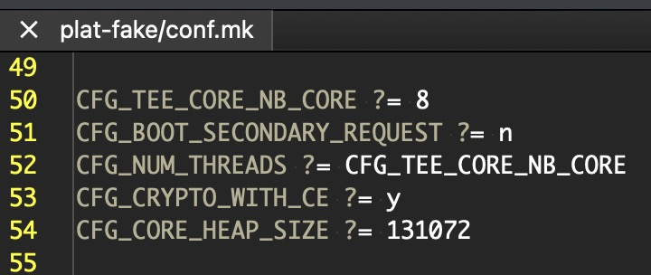

# RPC in Trusted Execution Environments (TEEs)

Trusted Execution Environments (TEEs) are becoming increasingly important in modern computing, especially in domains where data confidentiality and integrity are paramount, such as secure payments, digital rights management, and mobile security. One crucial component that enables interaction between the TEE and the outside world is the **Remote Procedure Call (RPC)** mechanism.

This article explores the concept of RPC in the context of TEEs, its architectural role, how it works, and the challenges associated with it.

---

## What is a Trusted Execution Environment (TEE)?

A **Trusted Execution Environment** is an isolated area within a processor that guarantees code and data loaded inside to be protected with respect to confidentiality and integrity. It runs alongside the main operating system (often referred to as the *Rich Execution Environment*, or REE) but is isolated from it.

Examples of TEEs include:

- ARM TrustZone (widely used in mobile and embedded devices)
- Intel SGX (Software Guard Extensions)
- AMD SEV (Secure Encrypted Virtualization)

---

## The Need for RPC in a TEE

TEEs are purposely limited in terms of available resources. They do not have direct access to devices like network interfaces, file systems, or user interfaces. Yet, secure applications running in a TEE (called **Trusted Applications**, or TAs) often need to perform operations that involve the non-secure world.

To handle such operations securely, TEEs use **RPC mechanisms** to request services from the **Normal World** (non-secure world, typically the main OS). These calls are controlled and monitored to prevent security breaches.

---

## How RPC Works in a TEE Context

Let’s take ARM TrustZone as an example:

1. **Client Application (CA)** in the REE invokes a command to the **Trusted Application (TA)** in the TEE.
2. The TEE OS processes the request.
3. If the TA needs to perform an operation it cannot handle (e.g., reading a file), it triggers an **RPC request** back to the REE.
4. The TEE pauses TA execution and switches context to the REE, sending the RPC parameters.
5. The REE handles the request (e.g., opens a file, reads content) and sends the response back to the TEE.
6. The TEE resumes the TA and returns the result.

This interaction is bi-directional:

- **REE → TEE**: Normal world calls into the secure world.
- **TEE → REE (RPC)**: Secure world asks the normal world to perform an external operation.

---

## Use Cases for RPC in TEEs

- **Accessing File Systems**: TAs often need to load or store data, which may reside on a normal-world file system.
- **Interacting with Hardware**: Devices like GPS, displays, and cameras are typically controlled by drivers in the REE.
- **Networking**: Since TAs don’t have access to network stacks, they may ask the REE to send/receive data.
- **Logging and Debugging**: Secure applications often rely on REE-based loggers for output.

---

## Security Considerations

While RPC expands the capabilities of TAs, it introduces a potential **attack surface**. Misuse or poor validation of RPC parameters can lead to:

- **Privilege escalation** if untrusted responses are not validated.
- **Information leakage** if sensitive data is exposed to the REE.
- **Denial of Service (DoS)** if the REE fails to respond to RPC calls.

To mitigate these risks:

- Always validate data exchanged over RPC.
- Use strict access control and input sanitization.
- Minimize reliance on RPC when possible.

---

## Implementation: Example from OP-TEE

[OP-TEE](https://www.op-tee.org/) is a popular open-source TEE implementation for ARM TrustZone. It supports RPC through a mechanism where the secure world sends a **yielding request** to the REE.

In OP-TEE:

- RPC types are defined (e.g., `OPTEE_RPC_CMD_SHM_ALLOC`, `OPTEE_RPC_CMD_FS`):
  - `RPC_CMD_SHM_ALLOC` / `FREE`: Allocate or free shared memory
  - `RPC_CMD_LOAD_TA`: Load another Trusted Application (TA)
  - `RPC_CMD_FS` / `RPMB`: Access file system or secure storage (Replay Protected Memory Block)
  - `RPC_CMD_GPROF` / `TRACE`: Performance analysis or logging
- The REE kernel driver (typically `optee.ko`) handles these commands and interacts with the REE services.
- Shared memory is often used to pass complex structures and large data between REE and TEE.

---

## Why Is TA Calling `optee-supplicant` Considered an RPC?

- In OP-TEE, a **Trusted Application (TA)** may need to perform operations that it cannot handle on its own, such as:
  - Accessing the file system
  - Communicating with I2C devices
  - Reading the real-time clock (RTC)

- These operations often require assistance from the **Rich Execution Environment (REE)**, such as Linux.

- In such cases, the TA performs a **Remote Procedure Call (RPC)** to the `optee-supplicant`, which is a user-space daemon running in the REE.

### 🔧 Example

When a TA wants to read a file from secure storage:

1. The TA makes an internal call to OP-TEE core.
2. OP-TEE core packages the request and issues an `OPTEE_MSG_RPC_CMD_*` to the supplicant.
3. `optee-supplicant` performs the action in Linux and returns the result to the TA.

### ✅ Why It's Considered RPC

- The communication:
  - Crosses **execution domains** (secure world to normal world)
  - Requires **context switching** between TEE and Linux
  - Follows a **request/response** model

> Even though it happens on the same device, the call meets the classic definition of an RPC (Remote Procedure Call).

---

## Can Multiple Client Applications (CAs) Run Concurrently on a Single-Core CPU in OP-TEE?

In the context of Trusted Execution Environments (TEE), particularly when using [OP-TEE](https://www.op-tee.org/), a common question arises:

> **Can multiple Client Applications (CAs) in the Normal World interact concurrently with Trusted Applications (TAs) in the Secure World, even when the system is powered by a single-core CPU?**

The answer is **yes**, and this capability is largely enabled by the **RPC mechanism and OP-TEE's thread/session architecture**.

---

### 1. Problem Setup: Multiple CAs, Single-Core CPU

In a system with only **one CPU core**, it is physically impossible to execute multiple instructions at the exact same time. This constraint also applies to transitions between the Normal World and the Secure World.

However, modern systems often have **multiple user-space applications** (CAs) trying to access the services of **Trusted Applications** (TAs) running under OP-TEE.

So the question becomes:

- Can multiple CAs **appear to be served concurrently** by OP-TEE, despite only one core?

---

### 2. The Key Enabler: RPC Triggers World Switch

OP-TEE uses **Remote Procedure Calls (RPC)** to access resources in the Normal World (e.g., file systems, shared memory, REE crypto libraries). Here's what happens during a typical CA–TA interaction:

1. A **CA** invokes a TA using the TEE Client API.
2. The OP-TEE kernel enters the **Secure World** and starts processing the request.
3. During execution, the TA might need to call out to **`optee-supplicant`** (in Normal World) for services like filesystem access.
4. To do this, **OP-TEE performs an RPC call**, which:
   - Suspends the current Secure World thread context.
   - Switches back to the Normal World.
5. At this moment, **other CAs** in the Normal World now get a chance to **initiate their own TEE calls**.
6. OP-TEE allocates a new thread for the new CA (if available) and services the second request in the Secure World.

This switching mechanism means that **multiple CAs can be "served" in an interleaved, concurrent fashion**, even though execution is strictly serial on a single CPU core.

---

### 3. How OP-TEE Supports Concurrent CA Calls

To enable this concurrency, OP-TEE internally uses:

#### 🔹 Thread Contexts

Each Secure World execution flow is mapped to a **thread context**, containing:

- Secure stack
- Register state
- Thread-local data

The number of available threads is limited by the `CFG_NUM_THREADS` build-time configuration (typically cpu core number).

#### 🔹 Sessions

Each CA-TA interaction takes place in the form of a **session**, which is a logical abstraction representing:

- Which CA initiated the call
- Which TA is being used
- Session-specific state (e.g., parameters, handles)

Each thread can manage multiple sessions over time.

---

### 4. Important Constraints

- Although CA calls may appear concurrent, **at any given moment only one Secure World thread is running** (due to the single-core constraint).
- **RPCs act as a natural yield point**, allowing the Secure World to pause one CA's request and service another.
- The number of simultaneous CA calls is limited by **available OP-TEE threads**.
- If no threads are available, OP-TEE will block or reject new requests with an error like `TEEC_ERROR_BUSY`.

---

### 5. Conclusion

Even on a **single-core CPU**, OP-TEE allows **multiple Client Applications** to interact "concurrently" with the Secure World through a clever combination of:

- **RPC-based world switching**
- **Thread-based execution contexts**
- **Session-based logical separation**

This architecture enables efficient use of the limited secure resources, while maintaining secure isolation and logical concurrency.

---

## Summary

RPC in TEEs is a powerful mechanism that bridges the gap between secure and non-secure worlds. It enables trusted applications to leverage untrusted services in a controlled manner. However, it also introduces complexity and security challenges that require careful design and implementation.

As TEEs become more prevalent, understanding and properly securing RPC mechanisms will be key to building trustworthy, high-assurance systems.

